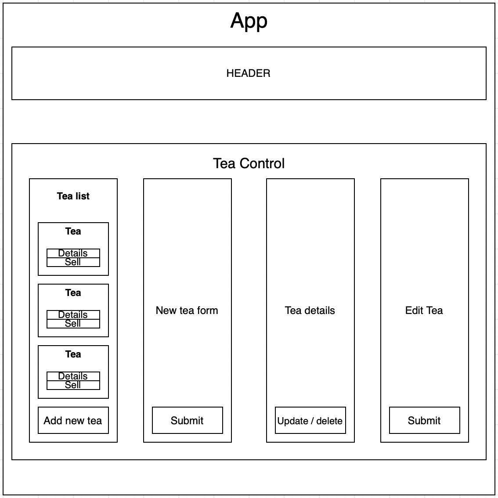

# Tea Shop

#### Tea Shop allows the owner to track their teas.

#### By Anton Ch

## Technologies Used

- CSS
- HTML
- JavaScript
- Node.js
- React

## Description


Tea Shop allows the owner to track their teas.

## Setup/Installation Requirements

- Click on or copy and paste this [GitHub Page](https://anton3ch.github.io/tea-shop/) into your preferred browser:<br>https://anton3ch.github.io/tea-shop/

  **_OR_**

- Clone this repository to your Desktop:
  1. Your computer will need to have GIT installed. If you do not currently have GIT installed, follow [these](https://docs.github.com/en/get-started/quickstart/set-up-git) directions for installing and setting up GIT.
  2. Once GIT is installed, clone this repository by typing following commands in your command line:
     ```
     ~ $ cd Desktop
     ~/Desktop $ git clone https://github.com/anton3ch/tea-shop.git
     ~/Desktop $ cd tea-shop
     ```
  3. Install necessary dependencies:
     ```
     ~/Desktop/tea-shop $ npm install
     ```
  4. Run:
     ```
     ~/Desktop/tea-shop $ npm run start
     ```

## Known Bugs

---

## Available Scripts

In the project directory, you can run:

### `npm start`

Runs the app in the development mode.\
Open [http://localhost:3000](http://localhost:3000) to view it in your browser.

The page will reload when you make changes.\
You may also see any lint errors in the console.

### `npm test`

Launches the test runner in the interactive watch mode.\
See the section about [running tests](https://facebook.github.io/create-react-app/docs/running-tests) for more information.

### `npm run build`

Builds the app for production to the `build` folder.\
It correctly bundles React in production mode and optimizes the build for the best performance.

The build is minified and the filenames include the hashes.\
Your app is ready to be deployed!

See the section about [deployment](https://facebook.github.io/create-react-app/docs/deployment) for more information.

### `npm run eject`

**Note: this is a one-way operation. Once you `eject`, you can't go back!**

If you aren't satisfied with the build tool and configuration choices, you can `eject` at any time. This command will remove the single build dependency from your project.

Instead, it will copy all the configuration files and the transitive dependencies (webpack, Babel, ESLint, etc) right into your project so you have full control over them. All of the commands except `eject` will still work, but they will point to the copied scripts so you can tweak them. At this point you're on your own.

You don't have to ever use `eject`. The curated feature set is suitable for small and middle deployments, and you shouldn't feel obligated to use this feature. However we understand that this tool wouldn't be useful if you couldn't customize it when you are ready for it.

## Learn More

You can learn more in the [Create React App documentation](https://facebook.github.io/create-react-app/docs/getting-started).

To learn React, check out the [React documentation](https://reactjs.org/).

## License

[ISC](https://opensource.org/licenses/ISC)

Copyright (c) 02/10/2023 Anton Ch

Permission to use, copy, modify, and/or distribute this software for any purpose with or without fee is hereby granted, provided that the above copyright notice and this permission notice appear in all copies.

THE SOFTWARE IS PROVIDED "AS IS" AND THE AUTHOR DISCLAIMS ALL WARRANTIES WITH REGARD TO THIS SOFTWARE INCLUDING ALL IMPLIED WARRANTIES OF MERCHANTABILITY AND FITNESS. IN NO EVENT SHALL THE AUTHOR BE LIABLE FOR ANY SPECIAL, DIRECT, INDIRECT, OR CONSEQUENTIAL DAMAGES OR ANY DAMAGES WHATSOEVER RESULTING FROM LOSS OF USE, DATA OR PROFITS, WHETHER IN AN ACTION OF CONTRACT, NEGLIGENCE OR OTHER TORTIOUS ACTION, ARISING OUT OF OR IN CONNECTION WITH THE USE OR PERFORMANCE OF THIS SOFTWARE.